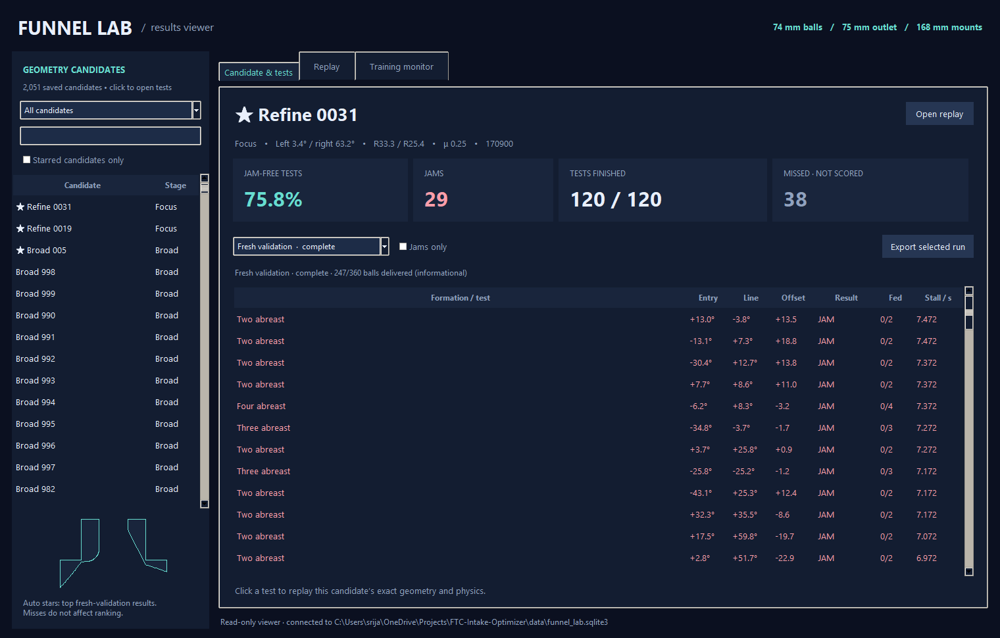

# Funnel Lab · Trainer & Results Viewer

A live Python physics simulator and jam-focused geometry optimizer for the FTC intake.

## Train from the terminal

Open a terminal in this project folder. On this computer, the wrapper finds the bundled Python runtime:

```powershell
.\train.cmd start                 # Full 100 + 2,000 geometry search
.\train.cmd start --quick         # Small end-to-end setup check
.\train.cmd status                # Latest session and saved progress
.\train.cmd pause                 # Request a checkpoint from another terminal
.\train.cmd resume                # Continue the latest saved search
.\train.cmd list                  # List every saved session
.\train.cmd export --output winner.json
```

Press **Ctrl+C once** to pause cleanly; wait for workers to save their completed tests. Resume skips cached geometry/test results. `pause`, `resume`, `status`, and `export` also accept a session ID instead of the latest session. A session cannot run in two trainers simultaneously.

Use `start --workers 4 --broad-geometries 100 --focused-geometries 2000` to change the budget. Every search count has a matching CLI flag; `start --help` lists them. `start --setup my_funnel.json` starts from saved geometry and physics; `start --from-candidate CANDIDATE_ID` starts from a stored candidate. Physics overrides include `--friction`, `--speed`, `--response`, `--acceleration`, and `--duration`. A resumed session retains its original configuration.

`start` and `resume` support `--max-seconds 60` for a timed checkpoint. Add `--json` for machine-readable output; training emits JSON lines. Other machines can use `python train.py` instead of `train.cmd`. Training opens no window and does not import Tkinter.

## Open the results viewer

Double-click **Launch Funnel Lab.vbs**, or run `python app.py`. The UI is now **read-only**: training happens separately in the terminal. Closing the viewer does not stop training. It refreshes the shared database about every two seconds without restarting your replay. Opening the viewer before the first search shows an empty library until results arrive.

Both programs default to `data/funnel_lab.sqlite3` beside their source files, regardless of the terminal's current folder. To use a different database, give both programs `--db PATH`. No internet is needed. On Windows x64 Python 3.12 the included `vendor` folder supplies the physics dependency; for other versions/platforms install `requirements.txt` and omit that folder.



The left sidebar lists geometry candidates. Click one to open its test groups: Broad survey, a Focus round, Finalist screening, or Fresh validation. Each reports completed/expected counts. Click a test to replay its exact geometry, physics settings, and incoming formation. Replay controls include speed, trails, restart, and single stepping. Filter **Jams only** to inspect failures, or **Starred candidates only** to see automatically selected finalists and existing favorites.

The **Training monitor** tab shows saved sessions, progress, and hardest jam cases. **Open validated winner** opens the winner only after fresh validation finishes. Automatic stars mark the top three validated candidates. Different test groups use different environments, so their scores should not be compared directly. Geometry SVG and run JSON/CSV exports remain available; the viewer cannot edit training records or stars.

## Adaptive optimizer

The default pipeline is:

1. **Broad survey:** 100 geometries, each tested on the same 240 environments. These balance 2, 3 and 4 balls, with varied approach angle, independent ball-line orientation, offset, ball spacing and stagger.
2. **Learn the jams:** count how often each test causes a jam across different geometries. A repeated cached result does not cast another vote. Escaped balls are not failures.
3. **Focused refinement:** try 2,000 new geometries. Each uses 48 difficult tests plus 12 rotating coverage tests. After every 100 new geometries, recompute which cases are hardest. Mutate strong candidates locally, shrink the mutation range over time, and keep occasional broad random exploration.
4. **Fair comparisons:** reevaluate incumbents on the exact same cohort as challengers in each round. At the end, compare the accumulated round champions on the full 240-case training suite.
5. **Fresh validation:** the top six screening candidates, plus the original search baseline if needed, each get the same 300 fresh environments. None of these holdout results feeds the geometry mutations. Rank them and star the top three. The baseline is eligible to win.

**The objective is jam rate, then mean stall duration. Missed balls, delivered fraction and elapsed travel time do not affect ranking.** A no-jam test can include balls escaping outside the wedge. Delivery and misses remain visible for interpretation. Automatic stars mean best among the evaluated candidates, not proof of a jam-free real robot or a global optimum.

All counts and CPU workers are adjustable. The 100 + 2,000 default is a substantial CPU job; duration depends on the processor and how long each scenario stalls. The CLI runs simulations in worker processes; the viewer can remain open independently. The fixed 960 Hz physics step and 50 solver iterations are not reduced for throughput.

Completed tests, including partial candidate runs, are saved to the shared database. The trainer checkpoints on Ctrl+C, `train.cmd pause`, or its time limit. Leave the terminal running to continue training after closing the viewer.

A small coverage sample remains during refinement because a geometry change can break an environment that worked for a previous candidate. The full easy suite is not rerun for every refinement candidate. A run is budgeted by the configured number of candidates; it does not keep consuming CPU indefinitely waiting for a perfect score.

## Saved files

- `data/funnel_lab.sqlite3`: persistent candidates, geometry/settings, per-test results, favorites, hard-case statistics, and search checkpoints. This stays in your OneDrive project folder and is ignored by Git.
- Existing `validation_report.json`, `verified_search.json`, and `latest_search.json` are preserved. Previously imported results remain available; the read-only viewer does not import or modify files.
- `studio_validation.json`: results of a reduced demonstration of the new pipeline. It explicitly records its smaller budget; it is not a completed 100/2,000 search.
- `adaptive_candidate.json`: the demonstration's jam-ranked winner, usable with `train.cmd start --setup adaptive_candidate.json`. Full candidate test groups and stars are retained in the local library.
- Export a selected candidate/run to JSON and CSV from the candidate page.

## Geometry and constraints

- Ball diameter: **74 mm**, fixed as requested.
- Inner outlet clearance: **75 mm**, exactly between collision surfaces.
- Funnel mounting width: **168 mm**, fixed.
- Outer wedge anchor width: **280.35 mm**, user-confirmed and fixed.
- Mounting line: **107.38628 mm** below the fixed outlet/top line, user-confirmed and fixed.
- Baseline left/right lips: **10 / 4 mm**. Left wall angle **30°**; right straight **24 mm**; right fillet **R30**.
- The screenshot does not label the left radius or outer wedge drop. Baseline assumes **R30 on the left and 40 mm wedge drops**, matching the image approximately. Those are adjustable.
- The top line is a geometric limit and open discharge, not a collision wall across the outlet. All solid funnel geometry stays at or below it.
- Outer upper wedge anchors stay fixed. Adjustable wedge drop moves the lower end along the plate edge. Wedge curve bends the lower contact surface while preserving its endpoints. Invalid/self-reversing designs are rejected.
- Curves use densely sampled circular arcs and quadratic wedge curves. SVG exports the exact polylines used by the solver, not native CAD arc entities.

## Physics and accuracy

Pymunk / Chipmunk2D provides simultaneous rigid-body contact impulses, nonpenetration constraints, Coulomb friction and rotational contact response. Both live and batch runs use the same engine, **960 fixed steps per simulated second**, and 50 solver iterations. Contact surfaces have zero added thickness, so the 75 mm outlet does not secretly shrink. Neighbor-aware segments avoid artificial cracks between arc pieces. Contact overlap is recorded in the reports.

The balls are represented as planar circles with hollow-sphere vertical-axis inertia. Their equal masses are normalized to 1 because drive is specified as acceleration, and the model contains no gravity or absolute force measurements. Printed Newton values or motor-load predictions are therefore intentionally absent.

The no-deadzone roller assumption is implemented as a finite drive toward an upward target speed wherever a ball reaches the wedge area. Before that point, the approach angle sets its target velocity. Drive acceleration is `(target velocity - actual velocity) / response time`, capped by the traction limit. Collisions can slow or stop the balls. Enforcing an exact velocity through a jam would violate the collision physics.

Defaults **220 mm/s**, **0.08 s response**, **2500 mm/s² traction**, **friction 0.25**, zero bounce and **0.12 s axial spin damping** are provisional, not measured properties of Pollen balls on PLA. Friction remains constant with angle: changing the wall angle changes contact normals and forces. This first model uses the same effective friction for ball-wall and ball-ball contact; those values may differ physically. Spin damping approximates roller restraint about the vertical axis, not a complete 3D rolling model.

This is a **planar transfer screening model**, not a validated digital twin. It cannot represent lifting, stacking, the holes in Pollen balls, ball or PLA deformation, layer texture, full sphere rolling on a floor, individual roller contact geometry, drive yaw during a pass, or motor torque. Diagonal translation and independently oriented ball formations are included. Every result applies only to these assumptions and the tested time horizon (8 s).

To improve real-world agreement, record a straight four-ball pickup and an angled pickup with your actual roller speed. Measure single-ball travel speed and compare observed stalls/exit timing. Calibrate the fixed friction and drive settings once, then rerun the geometry tests. A rigid planar simulation cannot prove that a physical mechanism never jams.

## Verification and command-line use

`python test_studio.py` checks jam-only scoring, independent scenario generation, candidate/run persistence, hard-case selection, cached-vote deduplication, pause/resume through the real multiprocessing physics pipeline, independent holdout sets, automatic stars, and native candidate selection/replay.

`python -c "import validate; validate.checks()"` runs the original numerical/geometry sanity checks, including a known jam and half-step comparisons. `python test_cli.py` checks cross-process pause/resume, winner export, a read-only viewer, and live refresh without interrupting playback. Use `python train.py start --quick` for a small complete search. The older `search.py` and `validate.py --search` remain available to reproduce the historical 24-candidate report; the new CLI uses the same `adaptive.py` engine.

Engine reference: https://www.pymunk.org/en/7.2.0/pymunk.html
